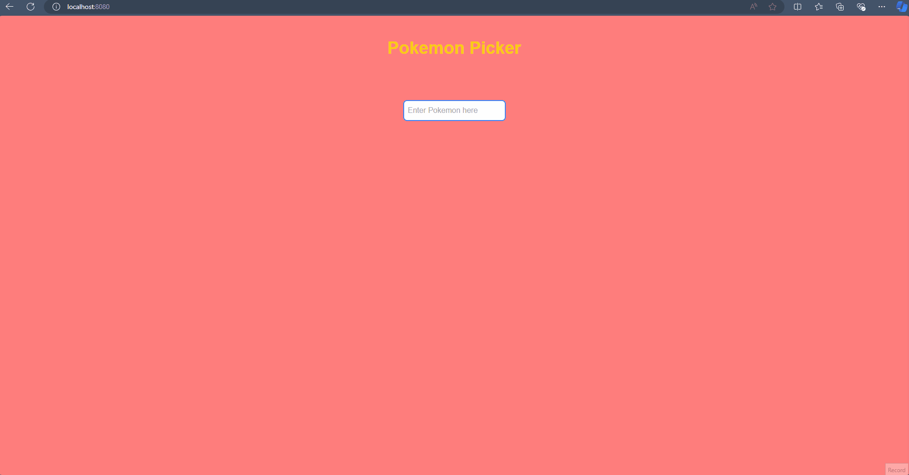

# Pokemon Picker



Pokemon Picker is a simple application built with Vue.js that allows users to search for and view details about their favorite Pokémon. The project uses the [PokéAPI](https://pokeapi.co/) to fetch real-time information about Pokémon.

## How It Works

- The app makes a request to the PokéAPI to fetch all available Pokémon.
- Users can type any Pokémon's name into the search bar.
- A filtered list of Pokémon appears as the user types.
- Clicking on a Pokémon redirects the user to a detail page, where they can see the Pokémon's images and types.

## Technologies Used

- **Vue.js**: The main framework used to build the application.
- **Tailwind CSS**: Used for styling the interface efficiently and responsively.
- **PokéAPI**: A public API providing detailed information about Pokémon.
- **Vue Router**: For navigation between the app's pages.

## Features

- **Real-time search**: Users can type a Pokémon's name into the input field and view a filtered list of suggestions.
- **Detailed view**: By clicking on a Pokémon's name, users are taken to a detail page where they can see the Pokémon's sprite and information such as its types.

## Project Structure

- **HomeView.vue**: The homepage where the user can search for Pokémon.
- **AboutView.vue**: The detail page that shows more information about the selected Pokémon, including its images and types.
- **App.vue**: The main component that contains the base layout of the application.
- **main.js**: The entry point file that initializes the Vue app and sets up the routing.

## Installation

1. Clone this repository.
```bash
   git clone https://github.com/Calebe-Xavier-Developer/vue-pokemon-app.git
```

2. Navigate to the project directory.
```bash
   cd vue-pokemon-app
```

3. Install the dependencies.
```bash
   yarn install
```

4. Start the development server.
```bash
   yarn serve
```

5. Access the application at http://localhost:8080.

## Contributing

Contributions are welcome! If you have suggestions or find bugs, feel free to open an issue or submit a pull request.
